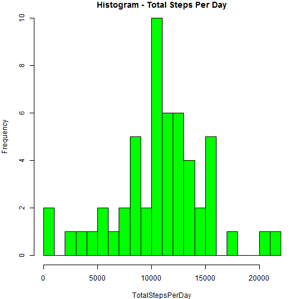
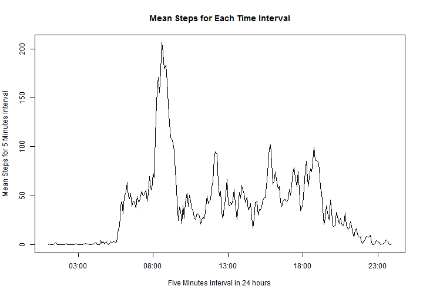
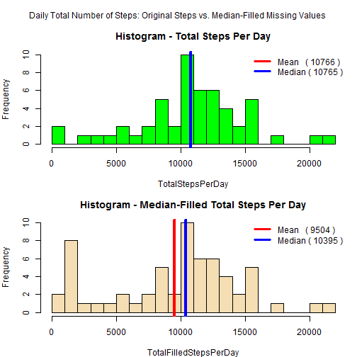
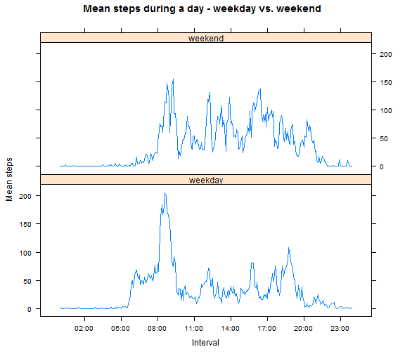

(Coursera "Reproducible Research: Peer Assessment 1")

## A. Loading and preprocessing the data

A-1. The following code read the file **activity.csv** from the working directory. (alternative code is suggested for reading it from a zip file in the working directory).  

```r
data <- read.csv("activity.csv", header=T)
##if the working folder contains a zip file instead of csv, use the following code instead:
##data <- read.table(unz("activity.zip", "activity.csv"), header=T, sep=",")
```

  - Check the data structure  

```r
head(data)
```

```
##   steps       date interval
## 1    NA 2012-10-01        0
## 2    NA 2012-10-01        5
## 3    NA 2012-10-01       10
## 4    NA 2012-10-01       15
## 5    NA 2012-10-01       20
## 6    NA 2012-10-01       25
```

```r
data[1000:1005,]
```

```
##      steps       date interval
## 1000     0 2012-10-04     1115
## 1001     0 2012-10-04     1120
## 1002   180 2012-10-04     1125
## 1003    21 2012-10-04     1130
## 1004     0 2012-10-04     1135
## 1005     0 2012-10-04     1140
```

```r
str(data)
```

```
## 'data.frame':	17568 obs. of  3 variables:
##  $ steps   : int  NA NA NA NA NA NA NA NA NA NA ...
##  $ date    : Factor w/ 61 levels "2012-10-01","2012-10-02",..: 1 1 1 1 1 1 1 1 1 1 ...
##  $ interval: int  0 5 10 15 20 25 30 35 40 45 ...
```

```r
with(data, sum(is.na(steps))) ##Check how many NA in variable steps
```

```
## [1] 2304
```
  - **Data structure summary:**  
The data has 17568 observations, three columns, headers: steps, date, interval.  
Variable steps is an integer or NA (2304 NAs), date is formatted YYYY-MM-DD,  
interval last two digits are the minutes, and first (one or two) digits are the hour.  

A-2. Format column date as.date to store information as 'day of the week', etc.  

```r
data$date <- as.Date(data$date)
```

## B. What is mean total number of steps taken per day?


B-1. Calculate the total number of steps taken per day  

```r
unique(data$date[which(is.na(data$steps))]) ##first check where are the NAs
```

```
## [1] "2012-10-01" "2012-10-08" "2012-11-01" "2012-11-04" "2012-11-09"
## [6] "2012-11-10" "2012-11-14" "2012-11-30"
```

  - The NAs are included in 8 days. Since there are 2304 NAs there are 8 whole days with NAs. If these days are not omitted, zeros will be added to the daily totals. The following code create a second dataset with no NAs, for the purpose of calculations.  


```r
data2 <- data[complete.cases(data), ] ##to omit days with no values at all
TotalStepsPerDay <- with(data2, sapply(unique(date), function(x) sum(steps[date==x], na.rm=TRUE)))
```
  - Following are the first values of the daily steps (days with no values are not included):  

```r
head(TotalStepsPerDay)  
```

```
## [1]   126 11352 12116 13294 15420 11015
```

B-2. Make a histogram of the total number of steps taken each day  
  - The following histogram shows the frequency of total steps taken each day (omitting NAs). The histogram is broken into more bars to show the zero values.  
  

```r
par(mar=c(4,4,1,1))
hist(TotalStepsPerDay, col="green", breaks=20, main="Histogram - Total Steps Per Day")
```

 


B-3. Calculate and report the mean and median of the total number of steps taken per day  

```r
meanSteps <- mean(TotalStepsPerDay)
medianSteps <- median(TotalStepsPerDay)
print(paste("Mean of daily steps: ", round(meanSteps), ", Median of daily steps: ", medianSteps))
```

```
## [1] "Mean of daily steps:  10766 , Median of daily steps:  10765"
```
  - **Answer**: The mean and median of the daily total steps are **10766** and **10765** steps.  

## C. What is the average daily activity pattern?

C-1. Calculate the steps mean for each time interval across all days:  

```r
MeanStepsPerInterval <- with(data2, sapply(as.character(unique(data$interval)), 
                                function(x) mean(steps[interval==x], na.rm=TRUE)))
```
  - Following are the first values of the mean steps for each 5 minutes interval:  

```r
head(MeanStepsPerInterval) 
```

```
##         0         5        10        15        20        25 
## 1.7169811 0.3396226 0.1320755 0.1509434 0.0754717 2.0943396
```
  - Plot the time series across all days:  

```r
##format intervals with ":" to show the hours/minutes
uniqueInterval <- as.character(unique(data$interval))
nch <- nchar(uniqueInterval)
formattedInterval <- paste0(substr(uniqueInterval, 1,nch-2), sprintf(":%02d", as.integer(uniqueInterval)%%100))
##plot the graph
plot(strptime(formattedInterval, "%H:%M"), MeanStepsPerInterval, 
                main="Mean Steps for Each Time Interval", type="l", 
                xlab="Five Minutes Interval in 24 hours", ylab="Mean Steps for 5 Minutes Interval")
```

 

C-2. Which 5-minute interval, on average across all the days in the dataset, contains the maximum number of steps?  

```r
maxMean <- formattedInterval[which(MeanStepsPerInterval==max(MeanStepsPerInterval))]
print(paste0("Maximum number of steps (average): ", round(max(MeanStepsPerInterval)), " for interval: ",
             maxMean))
```

```
## [1] "Maximum number of steps (average): 206 for interval: 8:35"
```
  - **Answer**: The 5 minutes interval with maximum average steps is **8:35 am**, with an average of **206 steps**.  

## D. Imputing missing values


D-1. Calculate and report the total number of missing values in the dataset (i.e. the total number of rows with NAs)  

```r
rowsWithMissings <- sum(!complete.cases(data))
print(paste0("The total number of rows with missing values is: ", rowsWithMissings))
```

```
## [1] "The total number of rows with missing values is: 2304"
```
  - **Answer**: The total number of missing values (total rows) is **2304**.  

D-2. Devise a strategy for filling in all of the missing values in the dataset. The strategy does not need to be sophisticated. For example, you could use the mean/median for that day, or the mean for that 5-minute interval, etc.  
  - **Answer**: The median of each steps time-interval reflects the most frequent value of steps,therefore, the NAs values were replaced in the variable *steps* with the median steps for each 5 minutes interval.  

D-3. Create a new dataset that is equal to the original dataset but with the missing data filled in.  
  - A small dataframe was created with interval and median total steps (two variables). Then, a new dataset was created that is equal to the original dataset and named "filledData". the NA values in the steps variable were replaced with values from the median variable (matched interval).  
  

```r
##create small data.frame with pairs of interval and median value
MedInterval <- data.frame(
        interval=unique(data$interval),  
        MedSteps=with(data2, sapply(unique(interval), function(x) median(steps[interval==x], na.rm=TRUE)))
        ) 
##create a new dataset to be filled with median values instead of NA
filledData <- merge(data, MedInterval, by="interval") ##merge the new dataset with the median values
filledData <- filledData[with(filledData, order(date, interval)), ] ##sort by date and interval

##update the steps only where there are NAs
filledData$steps[is.na(filledData$steps)] <- filledData$MedSteps[is.na(filledData$steps)]  
filledData <- filledData[,-4] ##remove column MedSteps (4th column) that is no longer needed
```

D-4. Make a histogram of the total number of steps taken each day and Calculate and report the mean and median total number of steps taken per day. Do these values differ from the estimates from the first part of the assignment? What is the impact of imputing missing data on the estimates of the total daily number of steps?  

  - Calculate the new daily total steps (for the "filled" dataset).  


```r
TotalFilledStepsPerDay <- with(filledData, sapply(unique(date), function(x) sum(steps[date==x], na.rm=TRUE))) 
meanFilledSteps <- mean(TotalFilledStepsPerDay)        ##new mean
medianFilledSteps <- median(TotalFilledStepsPerDay)    ##new median
```

  - The following histograms enable to compare the average daily steps calculated from the original steps (with NA), and the one calculated after filling the missing values with median values.  


```r
par(mfrow=c(2,1), mar=c(4,4,3,1), oma=c(0,0,2,0))   ##two graphs and outer title

hist(TotalStepsPerDay, col="green", breaks=25, main="Histogram - Total Steps Per Day")
abline(v=meanSteps,col="red", lwd=4)      ##add "mean" vertical line to the graph
abline(v=medianSteps,col="blue", lwd=4)   ##add "median" vertical line to the graph
legend("topright", col=c("red", "blue"), bty="n", lty=1,lwd=3,
       legend=c(paste("Mean   (",round(meanSteps),")"), paste("Median (", medianSteps,")")))

hist(TotalFilledStepsPerDay, col="wheat", breaks=25, main="Histogram - Median-Filled Total Steps Per Day")
abline(v=meanFilledSteps,col="red", lwd=4)      ##add "mean" vertical line to the graph
abline(v=medianFilledSteps,col="blue", lwd=4)   ##add "median" vertical line to the graph
legend("topright", col=c("red", "blue"), bty="n", lty=1,lwd=3,
       legend=c(paste("Mean   (",round(meanFilledSteps),")"), paste("Median (", medianFilledSteps,")")))

mtext("Daily Total Number of Steps: Original Steps vs. Median-Filled Missing Values", outer=TRUE)
```

 

  - **Answer:** After filling-in the median values for NAs, some low values added (as a peak) to the daily total steps. Other than that, the general look of the two histograms is quite similar. The mean of total steps with the filled-NAs is 9504, and is lower by 10262 steps than the mean of the original data. i.e. it decreased by 11.7 percent. The median was reduced by 370 steps (3.4%).  

## E. Are there differences in activity patterns between weekdays and weekends?

E-1. Create a new factor variable in the dataset with two levels – “weekday” and “weekend” indicating whether a given date is a weekday or weekend day.  


```r
user_lang <- Sys.getlocale("LC_TIME")            ##store user langugage settings
invisible(Sys.setlocale("LC_TIME", "English"))   ##set dates to english

filledData$dayorend <- factor(ifelse(weekdays(filledData$date) %in% c("Saturday", "Sunday") ,"weekend", "weekday"), 
                              levels=c("weekday", "weekend"))
```

E-2. Make a panel plot containing a time series plot (i.e. type = "l") of the 5-minute interval (x-axis) and the average number of steps taken, averaged across all weekday days or weekend days (y-axis). See the README file in the GitHub repository to see an example of what this plot should look like using simulated data.  
  - A new dataset is created to store the average steps for each day-interval. The new dataset is then restructed as the following sample table. The **reshape package** is required for running the following code.  
  
interval | dayFactor | meanSteps |  
:-------- | :---------: | :---------: |  
0 | weekday | 2.022 |  
5 | weekday | 0.400 |  
10 | weekday | 0.155 |  
. | . | . |  
. | . | . |  
2345 | weedkay | 0.177 |  
2350 | weedkay | 0.266 |  
2355 | weedkay | 1.266 |  
0 | weekend | 0.000 |  
5 | weekend | 0.000 |  
. | . | . |  
. | . | . |  
2345 | weekend | 1.625 |  
2350 | weekend | 0.000 |   
2355 | weekend | 0.000 |  


```r
##create a matrix with the means for weekdays and weekends, then convert it to data.frame
newFrame <- sapply(split(filledData, filledData$dayorend), function(y) with(y, tapply(steps, interval, mean)))  
newFrame <- as.data.frame(newFrame)
newFrame$interval <- rownames(newFrame)

##restructure the new dataset: interval, weekend/weeday, value / set col names and formats
invisible(library(reshape))  ##reshape package is required for changing the data structure
newFrame <- melt(newFrame, id="interval", dayFactor.vars=c("weekend","weekday")) 
names(newFrame)[2:3] <- c("dayFactor", "meanSteps")

##add numeric variable with constant intervals for Lattice numeric x
newFrame$intervalNum <- rep(1:288, 2)

invisible(Sys.setlocale("LC_TIME", user_lang))   ##restore user foreign language date/time
```

  - The new dataset is used to create two graphs for 24 hours activities (mean), one for weekends and one for weekdays. The factor variable *dayFactor* is used in a lattice graphs to separate the dataset values into two groups. The **lattice package** is required for the following graph.  
  

```r
invisible(library(lattice))  ##lattice package is required for ploting the following
toPrint <- xyplot(
        meanSteps ~ intervalNum | dayFactor, data=newFrame, panel = function(x, y, ...) 
            { panel.xyplot(x, y, ...) }, layout=c(1,2), xlab="Interval", ylab="Mean steps",
            main="Mean steps during a day - weekday vs. weekend", type="l", 
            scales = list(x=list(at = c(25,61,97,133, 169, 205, 241, 277), 
            labels = c("02:00", "05:00", "08:00", "11:00", "14:00", "17:00", "20:00", "23:00")))
        )
print(toPrint)
```

 


  - **Answer**: It seems that the subject **wakes up later or just rest at early morning hours during weekends** comparing to weekdays, but on the other hand, **for the rest of the day (weekends) the subject is much more active** comparing to weekdays. While on weekdays the subject rest at around 7:30 pm, **at weekends the subject is active until around 9:00 pm**. The **peak around 8:30 am is still there on weekends**, that might be an activity that is not related to working days, as doing some sport or taking the dog for a walk.  

